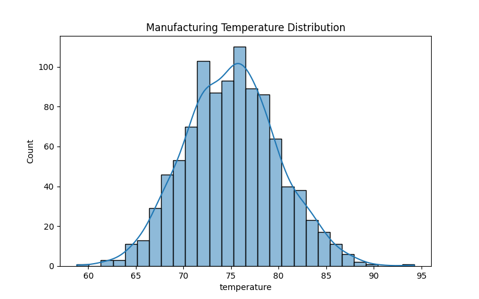

# Manufacturing Quality Deviation Analysis

Exploratory data analysis of manufacturing process parameters to identify quality deviations and production variability.

---

## Project Overview

This project analyzes manufacturing process data to identify deviations that may impact product quality. Using exploratory data analysis and visualization techniques, the goal is to understand how different process parameters influence variability and potential defects in production.

The analysis focuses on identifying patterns in manufacturing conditions such as temperature, pressure, and machine behavior that may lead to quality issues.

---

## Objectives

- Perform exploratory data analysis (EDA) on manufacturing process data
- Identify key variables contributing to quality deviations
- Visualize distributions and patterns in process parameters
- Provide insights that could help improve production quality and reduce defects

---

## Project Structure

```
manufacturing-quality-deviation-analysis
│
├── dataset
│   └── manufacturing_data.csv
│
├── notebooks
│   └── quality_deviation_analysis.ipynb
│
├── outputs
│   └── temperature_distribution.png
│
├── .gitignore
└── README.md
```

---

## Example Visualization



⸻

Dataset

The dataset contains manufacturing process variables such as:
	•	Temperature
	•	Pressure
	•	Machine speed
	•	Other process parameters affecting production quality

These variables are analyzed to detect abnormal distributions or deviations that may indicate potential quality issues.

⸻

Analysis Performed
	1.	Data loading and inspection
	2.	Data cleaning and preprocessing
	3.	Exploratory data analysis (EDA)
	4.	Distribution analysis of key process variables
	5.	Visualization of manufacturing parameter trends

⸻

Example Visualization


⸻

Tools & Technologies
	•	Python
	•	Pandas
	•	NumPy
	•	Matplotlib
	•	Jupyter Notebook

⸻

Key Insights
	•	Process parameters such as temperature show clear distribution patterns that can indicate operational stability.
	•	Monitoring these variables helps detect deviations early in the production process.
	•	Visualization of manufacturing data can support quality control and operational decision-making.

⸻

Author

Yash Pathak
Data Analytics / Business Analytics Project
:::


